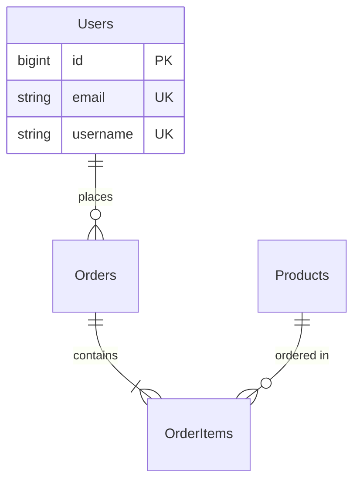

# Database Schema Design


## When to use this skill

Lists specific situations where this skill should be triggered:

- **New Project**: Database schema design for a new application
- **Schema Refactoring**: Redesigning an existing schema for performance or scalability
- **Relationship Definition**: Implementing 1:1, 1:N, N:M relationships between tables
- **Migration**: Safely applying schema changes
- **Performance Issues**: Index and schema optimization to resolve slow queries

## Input Format

The required and optional input information to collect from the user:

### Required Information
- **Database Type**: PostgreSQL, MySQL, MongoDB, SQLite, etc.
- **Domain Description**: What data will be stored (e.g., e-commerce, blog, social media)
- **Key Entities**: Core data objects (e.g., User, Product, Order)

### Optional Information
- **Expected Data Volume**: Small (<10K rows), Medium (10K-1M), Large (>1M) (default: Medium)
- **Read/Write Ratio**: Read-heavy, Write-heavy, Balanced (default: Balanced)
- **Transaction Requirements**: Whether ACID is required (default: true)
- **Sharding/Partitioning**: Whether large data distribution is needed (default: false)

## Instructions

### Step 1: Define Entities and Attributes
- Extract nouns from business requirements → entities
- List each entity's attributes (columns)
- Determine data types (VARCHAR, INTEGER, TIMESTAMP, JSON, etc.)
- Designate Primary Keys (UUID vs Auto-increment ID)

### Step 2: Design Relationships and Normalization
- 1:1 relationship: Foreign Key + UNIQUE constraint
- 1:N relationship: Foreign Key
- N:M relationship: Create junction table
- Determine normalization level (1NF ~ 3NF)

**Decision Criteria**:
- OLTP systems → normalize to 3NF (data integrity)
- OLAP/analytics systems → denormalization allowed (query performance)
- Read-heavy → minimize JOINs with partial denormalization
- Write-heavy → full normalization to eliminate redundancy

### Step 3: Establish Indexing Strategy
- Primary Keys automatically create indexes
- Columns frequently used in WHERE clauses → add indexes
- Foreign Keys used in JOINs → indexes
- Consider composite indexes (WHERE col1 = ? AND col2 = ?)
- UNIQUE indexes (email, username, etc.)
- Avoid excessive indexes (degrades INSERT/UPDATE performance)
- Composite index order optimized (high selectivity columns first)

### Step 4: Set Up Constraints and Triggers
- NOT NULL: required columns
- UNIQUE: columns that must be unique
- CHECK: value range constraints (e.g., price >= 0)
- Foreign Key + CASCADE option
- Set default values

### Step 5: Write Migration Scripts
- UP migration: apply changes
- DOWN migration: rollback
- Wrap in transactions
- Prevent data loss (use ALTER TABLE carefully)

**Example** (MySQL migration):
```sql
-- migrations/001_create_initial_schema.up.sql
START TRANSACTION;

CREATE TABLE users (
    id BIGINT UNSIGNED PRIMARY KEY AUTO_INCREMENT,
    email VARCHAR(255) UNIQUE NOT NULL,
    username VARCHAR(50) UNIQUE NOT NULL,
    password_hash VARCHAR(255) NOT NULL,
    created_at TIMESTAMP DEFAULT CURRENT_TIMESTAMP,
    updated_at TIMESTAMP DEFAULT CURRENT_TIMESTAMP ON UPDATE CURRENT_TIMESTAMP
) ENGINE=InnoDB DEFAULT CHARSET=utf8mb4 COLLATE=utf8mb4_unicode_ci;

COMMIT;

-- migrations/001_create_initial_schema.down.sql
START TRANSACTION;
DROP TABLE IF EXISTS users;
COMMIT;
```

## Output format

### Basic Structure

```
project/
├── database/
│   ├── schema.sql                    # full schema
│   ├── migrations/
│   │   ├── 001_create_users.up.sql
│   │   ├── 001_create_users.down.sql
│   │   └── ...
│   ├── seeds/
│   │   └── sample_data.sql           # test data
│   └── docs/
│       ├── ERD.md                     # Mermaid ERD diagram
│       └── SCHEMA.md                  # schema documentation
└── README.md
```

### ERD Diagram (Mermaid Format)



## Constraints

### Mandatory Rules (MUST)
1. **Primary Key Required**: Define a Primary Key on every table
2. **Explicit Foreign Keys**: Tables with relationships must define Foreign Keys (specify ON DELETE CASCADE/SET NULL)
3. **Use NOT NULL Appropriately**: Required columns must be NOT NULL; providing defaults is recommended

### Prohibited Actions (MUST NOT)
1. **Avoid EAV Pattern Abuse**: Use the Entity-Attribute-Value pattern only in special cases
2. **Excessive Denormalization**: Be careful when denormalizing for performance
3. **No Plaintext Storage of Sensitive Data**: Never store passwords, card numbers, etc. in plaintext

### Security Rules
- **Principle of Least Privilege**: Grant only the necessary permissions to application DB accounts
- **SQL Injection Prevention**: Use Prepared Statements / Parameterized Queries
- **Encrypt Sensitive Columns**: Consider encrypting personally identifiable information at rest

## Best practices

1. **Naming Convention Consistency**: Use snake_case for table/column names (tables plural, columns singular)
2. **Consider Soft Delete**: `deleted_at TIMESTAMP` (NULL = active, NOT NULL = deleted) for important data
3. **Timestamps Required**: Include `created_at` and `updated_at` in most tables

### Efficiency
- **Partial Indexes** (PostgreSQL): conditional indexes minimize index size
- **Materialized Views**: cache complex aggregate queries
- **Partitioning**: partition large tables by date/range

## Common Issues

### Issue 1: N+1 Query Problem
Replace per-row lookups in a loop with a single JOIN.

### Issue 2: Slow JOINs Due to Unindexed Foreign Keys
Always add an index on FK columns used in JOINs.

### Issue 3: UUID vs Auto-increment Performance
Random UUIDs cause index fragmentation. Use time-ordered UUID (`UUID_TO_BIN(UUID(), 1)` in MySQL) or `BIGINT AUTO_INCREMENT`.

## References
- [MySQL Documentation](https://dev.mysql.com/doc/)
- [PostgreSQL Documentation](https://www.postgresql.org/docs/)
- [Use The Index, Luke](https://use-the-index-luke.com/) — SQL indexing guide
- [dbdiagram.io](https://dbdiagram.io/) — ERD diagram creation

### Tags
`#database` `#schema` `#MySQL` `#PostgreSQL` `#SQL` `#NoSQL` `#migration` `#ERD`
