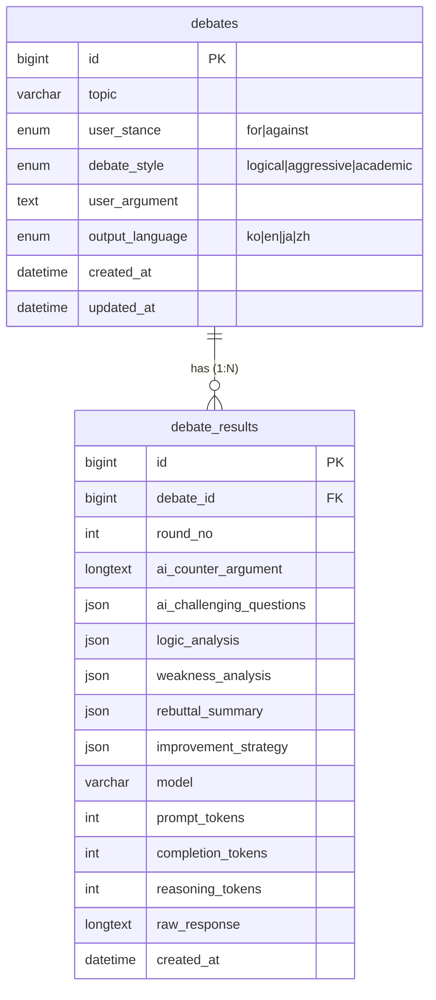

# DB 스키마 (ArguMentor)

ArguMentor의 MySQL 8.0 데이터 모델 문서. 실제 DDL은 [db/schema.sql](../db/schema.sql)이 단일
출처이며, 이 문서는 그 설계 의도·관계·값 매핑을 설명한다. PLAN.md §8 데이터 모델 초안을 정규화한 것이다.

- **DB명**: `argumentor`
- **엔진/charset**: InnoDB · `utf8mb4` · `utf8mb4_0900_ai_ci` (이모지·다국어 안전)
- **접근**: PHP는 PDO + prepared statement만 사용 (문자열 SQL 연결 금지)

## 생성/재현

```bash
# 스키마 생성 (IF NOT EXISTS라 반복 실행 안전)
mysql -u root -p < db/schema.sql
```

## ERD



## 관계

- `debates` **1 : N** `debate_results` — 한 토론 세션에 대해 AI 결과가 여러 번 생성될 수 있다(재반박/재생성
  라운드, `round_no`로 구분). MVP는 보통 1건만 쓰지만 1:N로 두어 "재반박 생성" 기능에 대비.
- FK `fk_results_debate`: `ON DELETE CASCADE` — 토론 삭제 시 결과도 함께 삭제. `ON UPDATE CASCADE`.

## `debates` — 토론 세션 입력

| 컬럼 | 타입 | 비고 |
|---|---|---|
| `id` | BIGINT UNSIGNED PK AI | |
| `topic` | VARCHAR(500) NOT NULL | 토론/면접 주제 |
| `user_stance` | ENUM('for','against') NOT NULL | 아래 값 매핑 참고 |
| `debate_style` | ENUM('logical','aggressive','academic') NOT NULL DEFAULT 'logical' | 선택사항 → 기본 logical |
| `user_argument` | TEXT NOT NULL | 사용자 1차 주장 또는 AI 생성 초안 |
| `output_language` | ENUM('ko','en','ja','zh') NOT NULL DEFAULT 'ko' | 응답 언어 |
| `created_at` / `updated_at` | DATETIME | 자동 타임스탬프 |

인덱스: `idx_debates_created_at`(기록 페이지 최신순 정렬), `idx_debates_language`(언어 필터).

## `debate_results` — AI 반박 + 분석

| 컬럼 | 타입 | 비고 |
|---|---|---|
| `id` | BIGINT UNSIGNED PK AI | |
| `debate_id` | BIGINT UNSIGNED NOT NULL FK | → `debates.id` |
| `round_no` | INT UNSIGNED NOT NULL DEFAULT 1 | 재반박 라운드 |
| `ai_counter_argument` | LONGTEXT NULL | AI 반대 논리(서술형) |
| `ai_challenging_questions` | JSON NULL | 도전/꼬리질문 **배열** |
| `logic_analysis` | JSON NULL | 논리 구조 분석(주장-근거-결론, 점수) |
| `weakness_analysis` | JSON NULL | 약점 분석(논리오류/근거부족/설득력) |
| `rebuttal_summary` | JSON NULL | 핵심 반박 포인트 목록 |
| `improvement_strategy` | JSON NULL | 개선 전략 |
| `model` | VARCHAR(64) NULL | 예: `deepseek-v4-pro` |
| `prompt_tokens` / `completion_tokens` / `reasoning_tokens` | INT UNSIGNED NULL | 비용/재현성 추적. `reasoning_tokens`는 DeepSeek thinking 모델 전용 |
| `raw_response` | LONGTEXT NULL | LLM 원본 응답(감사/디버깅). CLAUDE.md "raw + parsed 저장" 원칙 |
| `created_at` | DATETIME | |

> **JSON 타입 선택 이유**: PLAN.md는 longtext에 JSON 문자열 보관을 제안했지만, MySQL 8.0의 네이티브
> `JSON` 타입을 쓰면 저장 시 유효성 검증 + `JSON_EXTRACT`/`JSON_LENGTH` 쿼리가 가능하다. 분석 대시보드의
> 항목들은 모두 구조화 데이터(배열/객체)이므로 JSON이 적합하다.

## 값 매핑 (ENUM ↔ 화면/프롬프트)

DB는 언어 중립적인 영문 ENUM으로 저장하고, 표시·프롬프트 문구는 애플리케이션(컨트롤러/DTO)에서 매핑한다.
PLAN.md의 API 예시는 한국어 값(`찬성`, `논리적`)을 보내므로, 컨트롤러가 입력을 ENUM으로 변환해야 한다.

| 컬럼 | DB 값 | 한국어 표시 |
|---|---|---|
| `user_stance` | `for` / `against` | 찬성 / 반대 |
| `debate_style` | `logical` / `aggressive` / `academic` | 논리적 / 공격적 / 학술적 |
| `output_language` | `ko` / `en` / `ja` / `zh` | 한국어 / English / 日本語 / 中文 |

## JSON 컬럼 권장 형태 (예시)

분석 대시보드([LogicalAI](../LogicalAI/src/app/components/AnalysisDashboard.tsx))의 4개 탭에 대응.

```jsonc
// ai_challenging_questions
["AI 없이 동일한 학습이 가능한가?", "효율과 깊이 중 무엇이 우선인가?"]

// logic_analysis
{
  "structure": [
    {"label": "주장", "content": "..."},
    {"label": "근거", "content": "..."},
    {"label": "결론", "content": "..."}
  ],
  "scores": [{"label": "논리적 일관성", "value": 72}]
}

// weakness_analysis
[{"type": "논리적 오류", "items": ["성급한 일반화: ..."]}]

// rebuttal_summary
[{"point": "...", "detail": "...", "severity": "high"}]

// improvement_strategy
[{"title": "실증적 근거 보강", "items": ["관련 통계 인용", "..."]}]
```

> JSON 키 구조는 LLM 프롬프트의 출력 스키마와 1:1로 맞춰야 한다. 프롬프트를 바꾸면 이 형태와 대시보드
> 렌더링을 함께 갱신할 것. LLM은 `deepseek-v4-pro`(DeepSeek, OpenAI 호환 API)를 사용하며 설정은 `.env` 참고.
